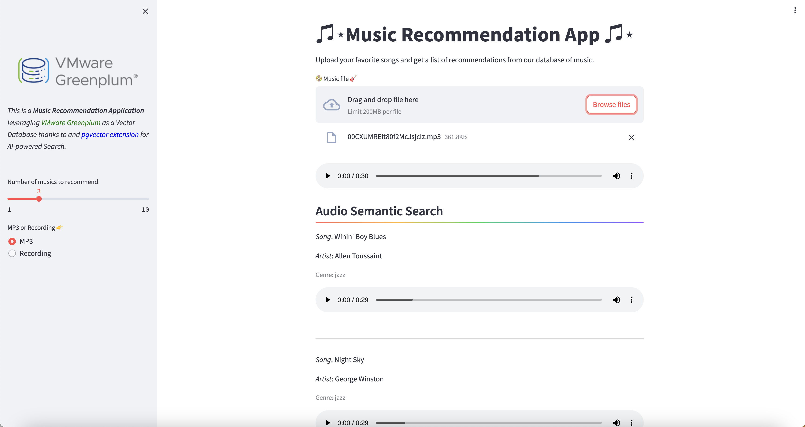

# Greenplum Audio Semantic Search

This repository provides instructions and code for setting up an Audio/Music Semantic Search engine leveraging VMware Greenplum as Vector Database.



## Getting Started

Follow these steps to set up the audio search system on your local machine.

### Prerequisites

- [Greenplum Database](https://greenplum.org/)
- [pgvector extension](https://github.com/pgvector/pgvector)
- [Kaggle API Access](https://www.kaggle.com/docs/api)
- [Docker](https://www.docker.com/)
- Jupyter Notebook
- Python dependencies (requirements.txt)

### Step 1: Create Database Tables

1. Run the `script.sql` file to create tables for storing metadata and embeddings in your Greenplum database:

    ```bash
    $ psql -U your_username -d your_database -a -f script.sql
    ```

### Step 2: Generate Embeddings

1. Use the `Audio_Semantic_Search.ipynb` Notebook to download the dataset and generate embeddings into Greenplum.
2. Install the required Python packages listed in `requirements.txt`.

### Step 3: Build Docker Image

1. Build your Docker image for the Greenplum audio search system:

    ```bash
    $ docker build -t greenplum-audio-search .
    ```

### Step 4: Run Docker Container

1. Run the Docker container for the audio search system:

    ```bash
    $ docker run -d -p 8501:8501 greenplum-audio-search
    ```

### Step 5: Access the Web App

1. Once the container is running, access the web application by opening a web browser and navigating to:

    ```
    http://localhost:8501
    ```
